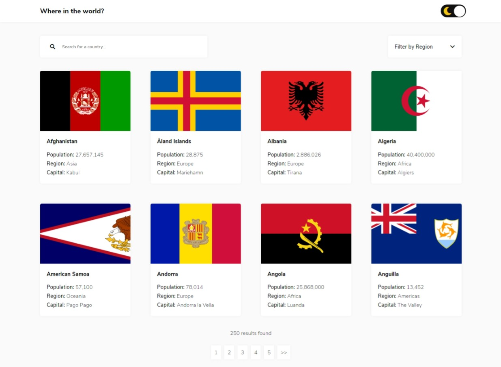
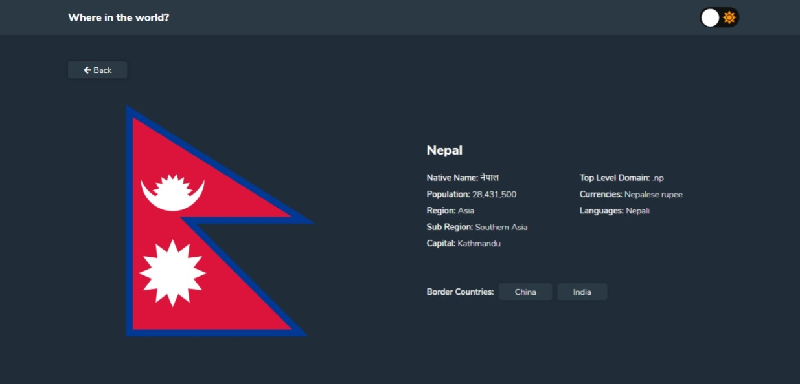

# Frontend Mentor - REST Countries API with color theme switcher solution

This is a solution to the [REST Countries API with color theme switcher challenge on Frontend Mentor](https://www.frontendmentor.io/challenges/rest-countries-api-with-color-theme-switcher-5cacc469fec04111f7b848ca). Frontend Mentor challenges help you improve your coding skills by building realistic projects.

## Table of contents

- [Overview](#overview)
  - [The challenge](#the-challenge)
  - [Screenshot](#screenshot)
  - [Links](#links)
- [My process](#my-process)
  - [Built with](#built-with)
  - [What I learned](#what-i-learned)
  - [Continued development](#continued-development)
- [Author](#author)
- [Credits](#credits)

## Overview

### The challenge

Users should be able to:

- See all countries from the API on the homepage
- Search for a country using an `input` field
- Filter countries by region
- Click on a country to see more detailed information on a separate page
- Click through to the border countries on the detail page
- Toggle the color scheme between light and dark mode

### Screenshot

### Links

- Live Site URL: [rcountries.tk](https://rcountries.tk)
- Live Site URL (If first link does not work): [country-rest.netlify.app](https://country-rest.netlify.app/)

## My process

### Built with

- Semantic HTML5 markup
- Flexbox
- CSS Grid
- [React](https://reactjs.org/) - JS library
- [Styled Components](https://styled-components.com/) - For styles

### What I learned

I have learnt so many things after doing this project. This took time but helped me a lot. I learned to use React hooks properly. I learned to implement Pagination, Dark Mode, Grid Layouts, etc. properly. Previously I just had knowledge about it but not proper practice as I did not find suitable project for me but now I learnt so many things doing this project. Including adding filters in website, search feature, routes using react-router, using context api of react js and much more.

### Continued development

If I want to continue in this project in future then I would like to implement so many things in this website. First of all I would like to include much more informations in country details page. I will include more informations below flag section. There I want to see more information of countries. I would also like to make back button of Country details page truly back. Suppose you search for country as "China" then China appears, then if you click China and click that button then it redirects you to home page but I want to make it such that it goes to search result page where user was previously. Though I can implement all these things right now but I am unable to do right now. I am hoping to continue it in future.

## Author

Hi, my name is Binamra Lamsal. I created this project with React JS after learning it as a practice. I know my project solution may not be ideal solution but I tried my best to make it best as I can. Feel free to provide me suggestions.

- Frontend Mentor - [@yourusername](https://www.frontendmentor.io/profile/binamracode)
- Twitter - [@yourusername](https://www.twitter.com/binamralamsal)

## Credits

- [Checkbox for Dark Mode - Florin Pop](https://codepen.io/FlorinPop17/pen/XWWZYYG)
